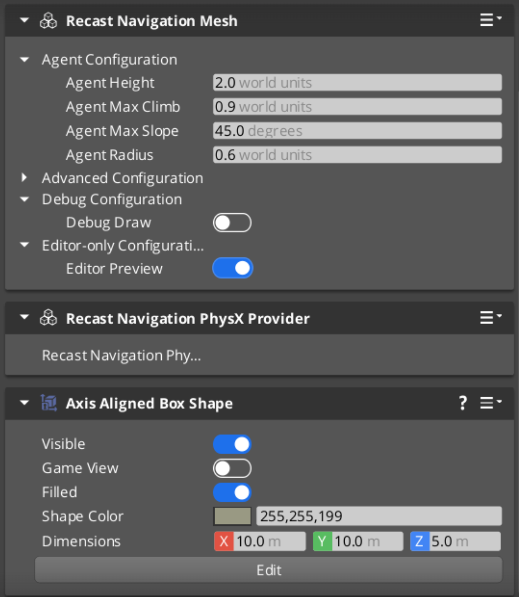
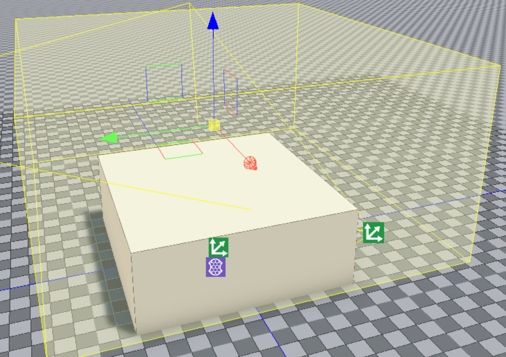
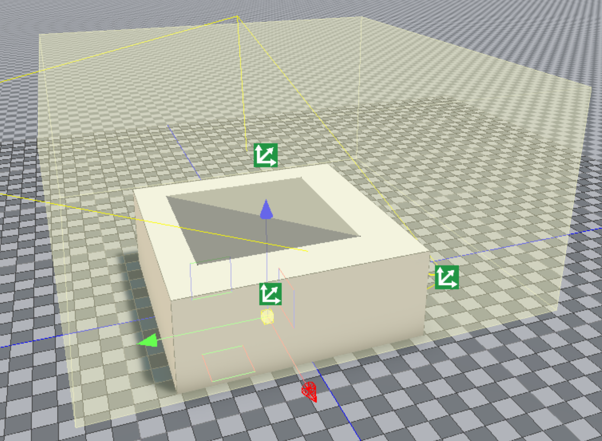
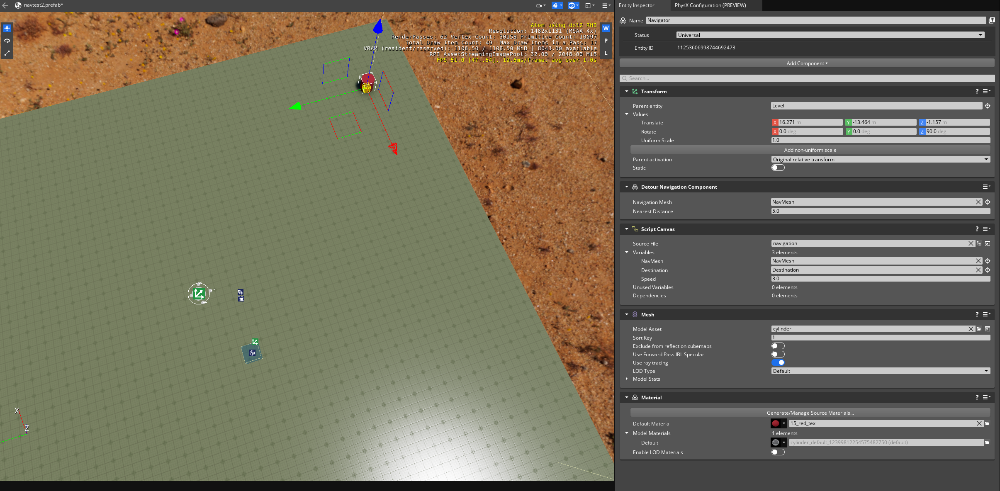
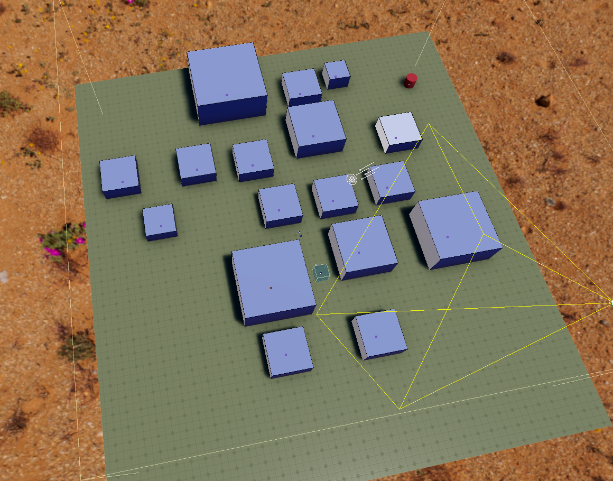
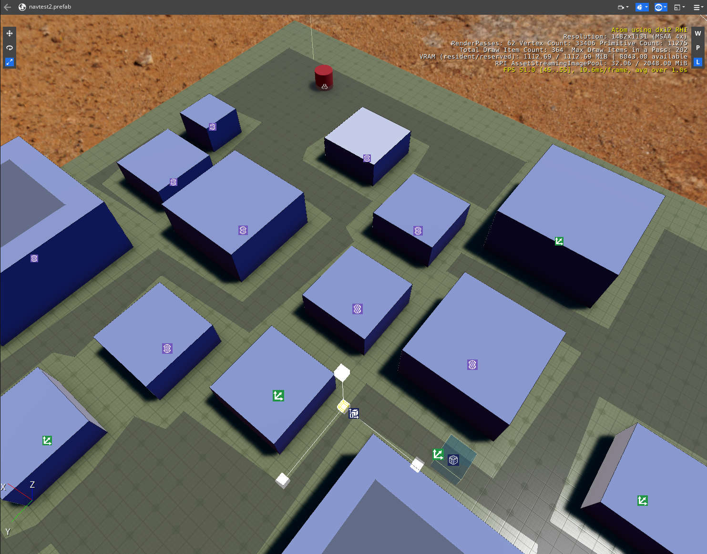

# AI LKG Workflow Tests

Testing in this area should focus on the AI functionality provided in the Recast Navigation gem.

## General AI Docs
* [O3DE Dev Docs: Recast Navigation](https://deploy-preview-1693--o3deorg.netlify.app/docs/user-guide/interactivity/navigation-and-pathfinding/recast-navigation/)

## Common Issues to Watch For

Test guidance will sometimes note specific issues to watch for. The common issues below should be watched for through all testing, even if unrelated to the current workflow being tested.
- Asset processor errors when saving levels with Recast NavMesh related components.
- Warnings or Errors that appear in the Editor Console Log while setting up or running scenes.
- Errors appearing in the Animation Editor's Log Window view.
- Path Finding doesn't obey collisions.
- Path Finding debug draw does not project correctly.

## Workflows

### Area: Stress Test Workflow using Automated Testing sample

**Project Requirements**
* You've read through the Recast Navigation docs.
* AutomatedTesting is set as your default project and has been built for editor and game launcher.
* Ability to deploy sample to Mobile device for mobile sample

**Editor Platforms:**
* Windows
* Linux

**Game Launcher Supported Platforms:**
* Windows
* Linux
* Mobile

**Product:** Proven that the Editor and Game Mode/Launcher are able to path find.

**Suggested Time Box:** 15 minutes per platform.

| Workflow                      | Requests                                                                                                                                                                                                                       | Things to Watch For                                                                                                                                                                                                                                                 |
|-------------------------------|--------------------------------------------------------------------------------------------------------------------------------------------------------------------------------------------------------------------------------|---------------------------------------------------------------------------------------------------------------------------------------------------------------------------------------------------------------------------------------------------------------------|
| **Editor Mode Stress Test**   | <ol><li>Open the Editor with AutomatedTesting project.</li><li>Open Navigation/NavigationSample level</li><li>Enter the game mode with CTRL+G.</li><li>Left click around the level to navigate the character around.</li></ol> | <ul><li>Level opens without errors.</li><li>Player entity navigates around the map.</li><li>Verify that there is no performance issues while navigating.<ul><li>Extreme Stutter.</li><li>Framerate falls to 1 or some other unusable frame rate</li></ul></li></ul> |
| **Game Launcher Stress Test** | <ol><li>Open the AutomatedTesting game launcher.</li><li>Open Navigation/NavigationSample level</li><li>Left click around the level to navigate the character around.</li></ol>                                                | <ul><li>Level opens without errors.</li><li>Player entity navigates around the map.</li><li>Verify that there is no performance issues while navigating.<ul><li>Extreme Stutter.</li><li>Framerate falls to 1 or some other unusable frame rate</li></ul></li></ul> |
---

### Area: In Editor Rendering Workflow

**Project Requirements**
* You've read through the Recast Navigation docs.
* Recast Navigation Gem has been enabled and built for the project (AutomatedTesting comes with this gem enabled).
* A level with at least two entities have been created.

**Editor Platforms:**
* Windows
* Linux

**Product:** A level that is able to project recast navigation meshes in the editor viewport.

**Suggested Time Box:** 30 minutes per platform.

| Workflow                                                                  | Requests                                                                                                                                                                                                                                                                                                                                                                                                                   | Things to Watch For                                                                                                                                                                                                                                                                                                                         |
|---------------------------------------------------------------------------|----------------------------------------------------------------------------------------------------------------------------------------------------------------------------------------------------------------------------------------------------------------------------------------------------------------------------------------------------------------------------------------------------------------------------|---------------------------------------------------------------------------------------------------------------------------------------------------------------------------------------------------------------------------------------------------------------------------------------------------------------------------------------------|
| **Configure NavMesh Entity**                                              | <ol><li>On the NavMesh entity add the following components:<ul><li>Recast Navigation mesh.<ul><li>Editor Preview: True</li></ul></li><li>Required: Recast Navigation PhysX Provider</li><li>Required: Axis Aligned Box Shape</li></uL></li></ol>                                                                                                                                                                           | <ul><li>Recast Nav Mesh component can be added to an entity and configured.</li><li>If required gems For Recast Nav Mesh component to work are not already on the Entity, the component will notify the user and provide them a path to adding the missing components.</li><li>Axis Aligned Box Shape can be added to the Entity.</li></ul> |
| **Configure White Box Collider Entity**                                   | <ol><li>On the Second Entity add the following components:<ul><li>White Box</li><li>White Box Collider</li></ul></li></ol>                                                                                                                                                                                                                                                                                                 | <ul><li>Components can be added to the entity.</li></ul>                                                                                                                                                                                                                                                                                    |
| **Set up and Manipulate the Scene to see in Editor Nav Mesh Projections** | <ol><li>Set up the Navigation Mesh and White Box entities to be intersecting.<ul><li></li></ul></li><li>Manipulate White Box to create distinct angles and faces for the nav mesh to project to.<ul><li></li></ul></li><li>Change the values on the Recast Navigation mesh while modifying the white box</li></ol> | <ul><li>Nav Mesh is projected to the entity during editor preview.</li><li>Changes in the Recast Nav Mesh values reflect upn the editor preview projection</li></ul>                                                                                                                                                                        |
| **Explore Further**                                                       | <ol><li>The Second Entity can be set up to use PhysX Terrain, PhysX Collider, and PhysX Shape Colliders instead of White Box & White Box Colliders</li></ol>                                                                                                                                                                                                                                                               | <ul><li>Nav Mesh behaviors are also possible on supported components.</li></ul>                                                                                                                                                                                                                                                             |
---

### Area: Recast Navigation Simple Scenario Workflow

**Project Requirements**
* You've read through the Recast Navigation docs.
* Recast Navigation Gem has been enabled and built for the project (AutomatedTesting comes with this gem enabled).
* A level with at least five (6) entities have been created.
* Ability to deploy sample to Mobile device for mobile sample.

**Editor Platforms:**
* Windows
* Linux

**Launcher Platforms:**
* Windows
* Linux
* Mobile

**Product:** A level that demonstrates a navigator that is able to navigate through a navigation mesh to a destination while avoiding obstacles that are in its path.

**Suggested Time Box:** 
* 30-45m per level generation per platform.
* 15 minutes per platform changing the destination and proving the pathing works.

| Workflow                                                                                  | Requests                                                                                                                                                                                                                                                                                                                                                                                                                                                                                                                                                                                                                                                                            | Things to Watch For                                                                                                                                                                                                                                                                                                                    |
|-------------------------------------------------------------------------------------------|-------------------------------------------------------------------------------------------------------------------------------------------------------------------------------------------------------------------------------------------------------------------------------------------------------------------------------------------------------------------------------------------------------------------------------------------------------------------------------------------------------------------------------------------------------------------------------------------------------------------------------------------------------------------------------------|----------------------------------------------------------------------------------------------------------------------------------------------------------------------------------------------------------------------------------------------------------------------------------------------------------------------------------------|
| **Configure the first entity as the NavMesh Entity.**                                     | <ol><li>On the NavMesh entity add the following components:<ul><li>Recast Navigation mesh.<ul><li>Editor Preview: True</li><li>Debug Draw: True</li></ul></li><li>Required: Recast Navigation PhysX Provider</li><li>Required: Axis Aligned Box Shape<ul><li>Modify the component to cover a larger area, such as 10 by 10 by 5 or larger.</li><li></li></ul></li></uL></li></ol>                                                                                                                                                                                                                                                       | <ul><li>If the Editor preview is not enabled, no gray area will be drawn during editor preview.<ul><li></li></ul></li><li>If the Editor preview is enabled, a gray area will be drawn during editor preview<ul><li></li></ul></li></ul> |
| **Configure an the second entity to act as the Ground Entity.**                           | <ol><li>On the Ground Entity add the following components:<ul><li>White Box</li><li>White Box Collider</li></ul></li><li>In the default Transform component, modify the scale to 6.</li><li>Resize the white box to be enveloped by the NavMesh entity.<ul><li></li></ul></li></ol>                                                                                                                                                                                                                                                                                                                                                         | <ul><li>Components can be added and configured to the entity.</li></ul>                                                                                                                                                                                                                                                                |
| **Configure the third entity to act as the destination Entity.**                          | <ol><li>On the Destination entity add the following components:<ul><li>Box Shape<ul><li>Game View: True</li><li>Visible: True</li><li>Filled: True</li><li>Shape Color: Desired Color</li><li>Dimensions: 1.0, 1.0, 1.0</li><li></li></ul></li></ul></li></ol>                                                                                                                                                                                                                                                                                                                                                                    | <ul><li>Components can be added and configured to the entity.</li></ul>                                                                                                                                                                                                                                                                |
| **Configure the Fourth entity to act as the Navigator Entity.**                           | <ol><li>On the Navigator entity add the following components:<ul><li>Detour Navigation Component<ul><li>Set to your Navigation Mesh entity.</li></ul></li><li>Mesh<ul><li>Apply a desired mesh (EG: cylinder, cube, hermanubis, ...).</li><li>Sort Key: 1</li></ul></li><li>Material<ul><li>Apply a desired default material (EG: 15_red_tex, 18_cyan_tex, ...).</li></ul></li><li>Script Canvas<ul><li>Apply the script canvas from instructions below.</li><li>Speed: desired speed in float (eg: 3.0).</li><li>NavMesh: Your NavMesh entity.</li><li>Destination: Your Destination Entity.</li><li></li></ul></li></ul></li></ol> | <ul><li>Components can be added and configured to the entity.</li><li>Script Canvas Component displays the expected variables.</li></ul>                                                                                                                                                                                               |
| **Create a maze of Obstacle Entities using the last Prerequsite Entity as the template.** | <ol><li>On the Obstacle entity add the following componenets:<ul><li>Mesh<ul><li>Apply desired mesh (EG: _box_1x1, _cylinder_1x1, ...).</li></ul></li><li>Material</li><li>PhysX Collider</li></ul></li><li>Scale the Obstacle Entity as desired.</li><li>Duplicate the Obstacle Entity and modify the position and scale enough times to create a maze.<ul><li></li></ul></li></ol>                                                                                                                                                                                                                                                         | When placing obstacles, the gray area will be updated during editor preview.                                                                                                                                                                                                        |
| **Create a Script Canvas script to drive the Navigator to find the Destination.**         | Script: [navigation.scriptcanvas](testassets/navigation.scriptcanvas)<ol><li>Use the attached script as the script attached to the Navigator entity<ul><li>Upgrade the script through the Script Canvas upgrader tool if needed.</li></ul></li><li>Recreate the attached script and make it the script attached to the Navigator.<ul><li>After above works, modify Generate Waypoints to use "Find Path Between Two Entities" vs "Find Path Between Two Points" in the Generate Waypoints group.</li></ul></li></ol> We want to test both scenarios to verify that an existing script and a newly created script function.                                                          | <ul><li>Script processes through Asset Processor without issue.</li><li>Script Can be applied to the Script Canvas component.</li><li>When recreating the Script Canvas, nodes to not cause crashes or other Script Canvas failures.</li></ul>                                                                                         |
| **Execute Level in Game Mode or Launcher with various maze layouts.**                     | <ol><li>Execute game mode to verify that the Navigator will navigate to the Destination while avoiding Obstacles</li><li>Place the destination in various positions and verify that the Navigator continues to navigate to the Destination while avoiding Obstacles.</li><li>Change the shape of the whitebox to include angles for the Navigator to climb while navigating.<ul><li>Additionally, you can play with the **Recast Navigation Mesh → Agent Max Slope.**</li></ul></li><li>Play with the **Recast Navigation Mesh** values under **Advanced Configuration** and **Agent Configuration.**</li></ol>                                                                     | Navigator will attempt to reach the destination in the shortest route possible.                                                                                                                                                                                                                |
| **Explore Further.**                                                                      | The Ground Entity can be set up to use PhysX Terrain, PhysX Collider, and PhysX Shape Colliders instead of White Box & White Box Colliders.                                                                                                                                                                                                                                                                                                                                                                                                                                                                                                                                         | Nav Mesh will map correctly to any supported Nav Mesh colliders and the Navigator entity will navigate around Obstacles to the Destination Entity.                                                                                                                                                                                     |
---

### Area: Recast Navigation Performance Workflow

**Project Requirements**
* You've read through the Recast Navigation docs.
* Recast Navigation Gem has been enabled and built for the project (AutomatedTesting comes with this gem enabled).
* A scenario created using the [**Recast Navigation Simple Scenario Workflow**](#Area:-Simple-Scenario-Workflow) above.
* A level with at least five (6) entities have been created.
* Ability to deploy sample to Mobile device for mobile sample.

**Editor Platforms:**
* Windows
* Linux

**Launcher Platforms:**
* Windows
* Linux
* Mobile

**Product:** A large level that demonstrates a navigator that is able to navigate through a navigation mesh to a destination while avoiding tons obstacles that are in its path.

**Suggested Time Box:** 
* 30-45m per level generation per platform.
* 15 minutes per platform changing the destination and proving the pathing works.

| Workflow                     | Requests                                                                                                                                                                                                                                                                                                                                                                                                                                                                                                         | Things to Watch For                                                                                                                                                                                                                                                                           |
|------------------------------|------------------------------------------------------------------------------------------------------------------------------------------------------------------------------------------------------------------------------------------------------------------------------------------------------------------------------------------------------------------------------------------------------------------------------------------------------------------------------------------------------------------|-----------------------------------------------------------------------------------------------------------------------------------------------------------------------------------------------------------------------------------------------------------------------------------------------|
| **Extra Large NavMesh**      | Using the **Recast Navigation Simple Scenario Workflow**:<ol><li>Enlarge the NavMesh & Ground entities to create an extremely large maze using Obstacles</li><li>Assign the Destination and Navigator entities to positions to navigate through a complicated path.</li><li>Enter game mode or open level in Game Launcher on supported platforms</li></ol>                                                                                                                                                      | <ul><li>Level opens without errors.</li><li>NavMesh displays.</li><li>Player entity navigates around the map.</li><li>Verify that there is no performance issues while navigating.<ul><li>Extreme Stutter.</li><li>Framerate falls to 1 or some other unusable framerate.</li></ul></li></ul> |
| **Multiple Navigators & Destinations**      | Using the **Recast Navigation Simple Scenario Workflow**:<ol><li>Add multiple desitinations that are in various locations.</li><li>Create multiple Navigators that are in various locations.</li><li>Assign the duplicated Navigators to various destinations, some should travel to the same destination.</li><li>Some Navigators should have simple paths and others moderate paths and others very complicated paths.</li><li>Enter game mode or open level in Game Launcher on supported platforms</li></ol> | <ul><li>Level opens without errors.</li><li>NavMesh displays.</li><li>Player entity navigates around the map</li><li>Verify that there is no performance issues while navigating.<ul><li>Extreme Stutter.</li><li>Framerate falls to 1 or some other unusable framerate.</li></ul></li></ul>  |
---

## Additional Coverage: New Features, Feature Improvements, Areas of Concern for Current LKG
This section should change for each LKG cycle to target new features, feature area improvements, or an area that has been presenting issues and can use additional coverage in the LKG cycle.

Execute the following Workflow Docs:

